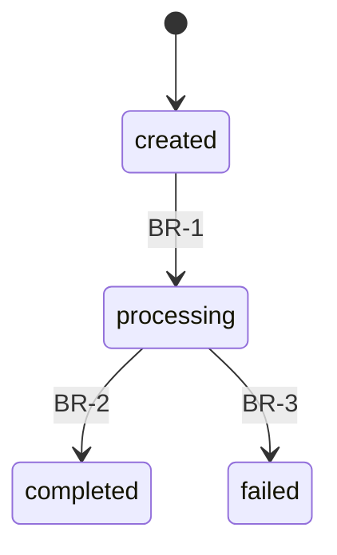

# {{ID}}: {{TITLE}}

<!-- 这份文档是 "当前功能的结论": 每一条都能直接拿去验收. 推导, 复现, 否决过的方案,
     file:line 都不进正文 -- 它们在 CR 与 review 里, 变更记录只指过去.
     判别: 这句话能不能被验收. 不能就不属于这里. -->

## 1. 背景与问题

<!-- 为什么有这个业务 / 为什么现在要做. 面向半年后第一次读到的人, 不假设读者知道
     当下的口头讨论. 有外部依据 (合规条款, 客户反馈, 线上事故) 就给出处. -->

## 2. 目标与非目标

### 目标

<!-- 做成之后世界有什么不同, 尽量可度量. -->

### 非目标

<!-- 明确排除的范围. 与目标同样重要: 它是日后判定 "这是范围内的 bug 还是范围外的
     新需求" 的依据. 每条最好带一句为什么排除. -->

## 3. 用户与场景

<!-- 谁在用, 什么场景, 走什么路径. "作为 X, 我需要 Y, 以便 Z" 或一段时序. 多角色分小节.
     外部系统 (补款程序, 第三方 webhook) 也算角色. -->

## 4. 功能需求

<!-- 逐条编号, 每条独立可验收, 规范语气 "必须 / 不得". 一条只说一件事.
     条目号一旦发布不重排: CR 与 review 按号引用. 删除的条目保留编号并标
     "已删除, 见 CR-NNN". 新增续编当前最大号.
     只写业务语言: 不写表, 字段, 函数名 (数据落点在第 7 节, 代码落点在第 11 节). -->

- **FR-1**:
- **FR-2**:

## 5. 业务逻辑与边界

<!-- 图是导览, 编号规则 (BR-x) 是规范文本. 图上每条迁移 / 分支必须对应一条 BR;
     CR 只引用编号不引用图. 不适用的小节写 "无", 不删小节. -->

### 5.1 状态机

<!-- 有生命周期的核心实体每个一张 stateDiagram 配一张迁移表. 图回答 "有哪些状态和
     迁移", 表回答 "谁在什么条件下触发, 有什么副作用". 图上不存在的迁移即非法迁移. -->

| 编号 | 迁移 | 触发者 | 前置条件 | 副作用 |
|---|---|---|---|---|
| BR-1 | created -> processing | | | |

### 5.2 关键流程

<!-- 跨系统 / 跨角色的流程用 sequenceDiagram (调用方, 本系统, 第三方, webhook 回来的
     异步腿都画上); 单流程内的分支用 flowchart. 只画不画就会产生歧义的流程. -->

### 5.3 规则表

<!-- 组合条件类规则 (费率, 限额, 币种 / 精度矩阵, 风控处置) 用决策表, 每行一个编号
     (继续 BR 序列), 自上而下首条命中. 不要写成散文, 也不要塞进图里. -->

| 编号 | 条件 | 结果 |
|---|---|---|
| BR-x | | |

### 5.4 边界与失败路径

<!-- 幂等与去重, 并发约束 (锁的范围), 超时与重试, 未知结果的收敛, 人工介入点.
     正常路径在上面, 这里专门回答 "出错了或者边界上会发生什么", 同样逐条编号.
     已接受的风险也写在这里: "已接受风险: ..., 处置是 ..." -- 这是结论, 论证在 review. -->

## 6. 非功能需求

<!-- 性能, 安全 (2FA, 权限), 合规与审计 (什么必须留痕, 谁能改), 可观测性
     (需要什么日志 / 指标 / 告警, 告警携带什么字段). 没有就明确写 "无特殊要求". -->

## 7. 数据影响

<!-- 定的是 "数据层面必须记录什么, 什么必须唯一": 字段语义, 可空性, 默认值, 枚举取值,
     唯一约束 (幂等键). 索引与命名这类纯实现细节留给迁移评审. 没有就写 "无". -->

### 7.1 涉及的表与字段

<!-- 新表, 加字段, 改语义逐行列; 只读取的表也列一行 (变化写 "仅读取"), 让日后改那些表
     的人知道谁在依赖. "来源条目" 回指要求这条数据的 FR / BR. -->

| 表 | 变化 | 字段 | 类型与约束 | 来源条目 | 说明 |
|---|---|---|---|---|---|
| | 新表 / 加字段 / 改语义 / 仅读取 | | | FR-x / BR-x | |

### 7.2 迁移与回填

<!-- 存量要不要回填, 按什么规则; 迁移能否安全回滚 (回滚会不会销毁审计记录);
     上线期间新旧代码是否要同时兼容两种数据形态. -->

## 8. 外部影响

<!-- API 合同变化, 第三方依赖, 运营 / 客服流程变化. 没有写 "无". -->

## 9. 验收标准

<!-- 逐条编号 AC-x, 覆盖第 4 节每一条 FR 和第 5 节的关键边界, 标注来源条目.
     每条写成可观察的行为 (给定什么输入, 看到什么结果), 不写实现. 负例也要有
     (给定非法输入, 必须被拒). 验收的执行在 PR / 测试里, 本节只记标准, 不维护勾选. -->

- **AC-1** (FR-1):
- **AC-2** (FR-2):

## 10. 开放问题

<!-- 未决问题, 每条写明预计何时前解决. 置 implemented 前必须清空: 要么解决, 要么显式降级
     为已接受的风险写进 5.4 或第 6 节. -->

## 11. 代码落点 (导览)

<!-- 文件 / 包级别, 不写行号 (行号会漂). 目的是让半年后的人和下一个 AI 会话知道从哪读起:
     入口 (API handler / worker), 核心判定 (状态机在哪, 规则表在哪), 存储 (查询文件, 迁移号),
     测试 (覆盖 AC 的测试文件). 已有业务由 /req 侦察时填; 全新业务此时还没有代码, 留空,
     由 /implement-cr 落实时填. -->

| 部分 | 位置 | 说明 |
|---|---|---|
| 入口 | | |
| 核心判定 | | |
| 存储 | | |
| 测试 | | |

## 变更记录

<!-- 只追加, 不修改历史行. 初稿也占一行. 行为变更的行写 CR 编号; 措辞订正写 "-" 并注明
     "未改变既定行为". 结论的来源是 review 时, 在摘要里写 review 编号 (如 "CR-005 I-3"),
     论证留在那边, 这里只指过去. -->

| 日期 | CR | 摘要 |
|---|---|---|
| {{DATE}} | - | 初稿 |
